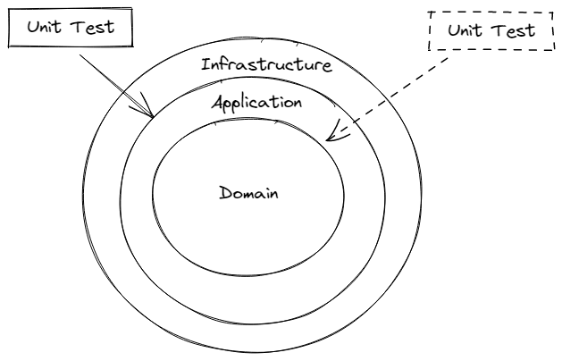
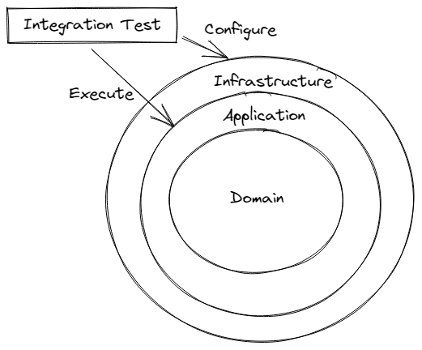
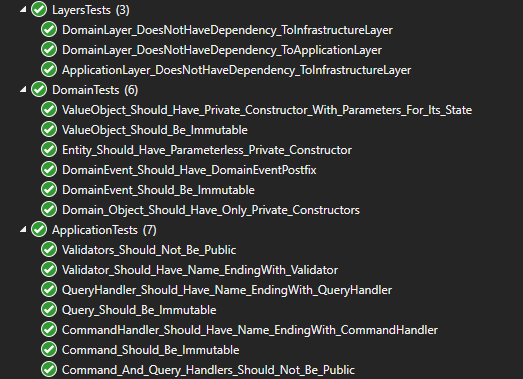

# Architectural Foundation

This document provides a description of general architectural concepts and principles. It includes a description of how `Domain Driven Development` and `hexagonal architecture` is tailored and used in the implementation.


## Domain

**Definition**

> Domain - A sphere of knowledge, influence, or activity. The subject area to which the user applies a program is the domain of the software.
> [Domain Driven Design Reference](http://domainlanguage.com/ddd/reference/), Eric Evans

## Conceptual Model

> Conceptual Model - A conceptual model is a representation of a system, made of the composition of concepts that are used to help people know, understand, or simulate a subject the model represents. [Wikipedia - Conceptual model](https://en.wikipedia.org/wiki/Conceptual_model)

## EventStorming

There are many ways to show behavior and events. One of them is a light technique called EventStorming which is becoming more popular. Below are presented 3 main business processes using this technique: user registration, meeting group creation and meeting organization.

> EventStorming is a light, live workshop. One of the possible outputs of this workshop is presented here.

## Architecture

### Architecture Decision Log

All Architectural Decisions (AD) are documented in the [Architecture Decision Log (ADL)](/docs/adr).

More information about documenting architecture-related decisions in this way : [https://github.com/joelparkerhenderson/architecture_decision_record](https://github.com/joelparkerhenderson/architecture_decision_record)

#### Install adr-tools

<https://baldir.fr/posts/install-adr-tools-on-windows-with-git-bash/>

<https://github.com/npryce/adr-tools/blob/master/INSTALL.md#windows-10>

### C4 Model

[C4 model](https://c4model.com/) is a lean graphical notation technique for modelling the architecture of software systems.

As can be found on the website of the author of this model ([Simon Brown](https://simonbrown.je/)): *The C4 model was created as a way to help software development teams describe and communicate software architecture, both during up-front design sessions and when retrospectively documenting an existing codebase*

*C4 model* defines 4 levels (views) of the system architecture: *System Context*, *Container*, *Component* and *Code*. In this document we do not have any diagrams on the code level.

> *Note: The [PlantUML](https://plantuml.com/) (diagram as text) component was used to describe all C4 model levels. Additionally, for levels C1-C3, a [C4-PlantUML](https://github.com/plantuml-stdlib/C4-PlantUML) plug-in connecting PlantUML with the C4 model was used*.

### Domain Model Principles and Attributes

The Domain Model, which is the central and most critical part in the system, will be designed with special attention. Here are some key principles and attributes which are applied to Domain Models of each module:

1. High level of encapsulation

   All members are `private` by default, then `internal` - only `public` at the very edge.

2. High level of Persistence Ignorance

    No dependencies to infrastructure, databases, etc. All classes are [POCOs](https://en.wikipedia.org/wiki/Plain_old_CLR_object).

3. Rich in behavior

    All business logic is located in the Domain Model. No leaks to the application layer or elsewhere.

4. Low level of Primitive Obsession

    Primitive attributes of Entites grouped together using ValueObjects.

5. Business language

    All classes, methods and other members are named in business language used in this Bounded Context.

6. Testable

   The Domain Model is a critical part of the system so it should be easy to test (Testable Design).

### Building blocks

#### Command

> A command is a request made to do something. A command represents the intention of a system’s user regarding what the system will do to change its state.
>
> Command characteristics:
>
> - The result of a command can be either success or failure; the result is an [DomainEvent(s)](#1286-domain-event)
>
> - In case of success, state change(s) must have occurred somewhere (otherwise nothing happened)
>
>- Commands should be named with a verb, in the present tense or infinitive, and a nominal group coming from the domain (entity of aggregate type)
>
>Source: [Open Agile Architecture](https://pubs.opengroup.org/architecture/o-aa-standard/#KLP-EDA-event-command)

#### Query

> A query is a request made to fetch some data. A query does not change state in the domain. A query may circumvent the domain and fetch data directly from a repository.

#### Aggregate

To avoid having large cumbersome aggregate objects **aggregates are not used**. However, since aggregate obejcts are the only addressable objects outside of the domain, you can think of entities as 'small' aggregates.

#### Entity

 >When an object is distinguished by its identity, rather than its attributes, make this primary to its definition in the model. Keep the class definition simple and focused on life cycle continuity and identity. Define a means of distinguishing each object regardless of its form or history.
>
>Source: [Domain-Driven Design: Tackling Complexity in the Heart of Software, Eric Evans](https://www.amazon.com/Domain-Driven-Design-Tackling-Complexity-Software/dp/0321125215)

Entities extend `Entity`. This base class brings along these properties:

- `Id` - Unique Id for the Entity itself
- `Created` - Date and time of the creation of an instance
- `Updated` - Date and time of the last update made to an instance

Entities *does* not have `public` constructors. Instead they are created by factory methods.

Entities is where domain logic lives.

#### Domain Event

A Domain Event is the result of a `state change` in an `Entity`. It´s a fact that something has happend inside a `Module`. Other `Entities` inside the `Module` can react on raised `Domain Events` and change perform state changes.

> An event is something that has happened in the past. A **domain event** is, something that happened in the domain that you want other parts of the same domain (in-process) to be aware of. The notified parts usually react somehow to the events.

#### Integration Event

An Integration Event is the result of a `state change` in an `Entity`. Just as a domain event, it is a fact that something has happened inside a `Module`. Other modules can react to raised `Integration Events` and perform state changes.

#### Repository

We use repositories in order to retrive domain object from persistence technologies. Using software design principels like Liskov Substitution Principle, we can design this in a way so that we can easily make architecture desicions to swith between in-memory repository for testing and a PostgreSQL implementation for runtime.

#### Value Object

If there is something in the domain that **is** something we will create a `Value Object`. If we don´t do this is properly becurse we have some kind of Primitive Obsession.

> Primitive Obsession is when the code relies too much on primitives. It means that a primitive value controls the logic in a class and this value is not type safe. Therefore, primitive obsession is when you have a bad practice of using primitive types to represent an object in a domain.
>
> A string is sometimes not a string. Model it accordingly.

Value objects *does* not have `public` constructors. Instead they are created by factory methods.

Example:

```csharp
public string Value { get; private set; }

public static GroupName Default { get { return new GroupName(string.Empty); } }

private GroupName(string name)
{
  Value = name;
}

public static GroupName For(string name)
{
  if(string.IsNullOrWhiteSpace(name))
  {
    throw new ArgumentException("Group name must be human readable");
  }

  return new GroupName(name);
}

```

Value objects extend `ValueObject` that implements `IEquatable<ValueObject>`. This ensures that we have overridden the Equals operator and we can now compare objects like this:

```csharp
var g1 = GroupName.For("QA");
var g2 = GroupName.For("QA");

var equal = g1.Equals(g2);
var equal = g1 == g2;
var notEqual = g1 != g2;

```

We can also verify if the object is present in a collection:

```csharp
var g1 = GroupName.For("QA");
var g2 = GroupName.For("Developer");
var collection = new List<GroupName>() { g1 };

var contains = collection.Contains(g1);
var doesnotContain = collection.Contains(g2);

```

Using Value Objects instead of primitives:

- Makes code easier to understand by using ubiquitous language instead of just string.
- Improves security by ensuring invariants of every property.
- Encapsulates specific business rules associated with a value.

> Without domain primitives, the remaining code needs to take care of validation, formatting, comparing, and lots of other details. Entities represent long-lived objects with a distinguished identity, such as articles in a news feed, rooms in a hotel, and shopping carts in online sales. The functionality in a system often centers around changing the state of these objects: hotel rooms are booked, shopping cart contents are paid for, and so on. Sooner or later the flow of control will be guided to some code representing these entities. And if all the data is transmitted as generic types such as int or String , responsibilities fall on the entity code to validate, compare, and format the data, among other tasks. The entity code will be burdened with a lot of tasks, rather than focusing on the central business flow-of-state changes that it models. Using domain primitives can counteract the tendency for entities to grow overly complex.
>
> Quote from: [Secure by design: Chapter 5.3 Standing on the shoulders of domain primitives](https://livebook.manning.com/book/secure-by-design/chapter-5/96)

#### Domain Event

> An event is something that has happened in the past. A **domain event** is, something that happened in the domain that you want other parts of the same domain (in-process) to be aware of. The notified parts usually react somehow to the events.

Domain events extend `DomainEvent` which in-turn implements the `IDomainEvent` interface.

Base event details:

- `Id` - Auto generated unique Id for the event itself.
- `OccurredOn` - The point-in-time when the event happened.

All properties are `get` only, because an event is something that has happened in the past, and you can not change the past.

#### Integration Event

#### Error handling

Examples:

Entity not found:

```json
{
type: "https://httpstatuses.com/404",
title: "Not Found",
detail: "Analysis was not found",
instance: "/api/v0/GetAnalysis",
status: 404,
traceId: "0HMBG3VD22RNV:00000008"
}
```

### Modules Integration

### Security

### Unit Tests

>A unit test is an automated piece of code that invokes the unit of work being tested, and then checks some assumptions about a single end result of that unit. A unit test is almost always written using a unit testing framework. It can be written easily and runs quickly. It’s trustworthy, readable, and maintainable. It’s consistent in its results as long as production code hasn’t changed. [Art of Unit Testing 2nd Edition](https://www.manning.com/books/the-art-of-unit-testing-second-edition) Roy Osherove

#### Attributes of good unit test

- Automated
- Maintainable
- Runs very fast (in ms)
- Consistent, Deterministic (always the same result)
- Isolated from other tests
- Readable
- Can be executed by anyone
- Testing public API, not internal behavior (over specification)
- Looks like production code
- Treated as production code

#### Implementation

Unit tests should mainly test business logic (domain model):



All unit test will be run as part of our CI build pipeline. Only if all tests are Green the build will pass.

### Integration Tests

> "Integration Test" term is blurred. It can mean test between classes, modules, services, even systems - see [this](https://martinfowler.com/bliki/IntegrationTest.html) article (by Martin Fowler).

For this reason, the definition of integration test in this project is as follows:

- it verifies how system works in integration with "out-of-process" dependencies - database, messaging system, file system or external API
- it tests a particular use case
- it can be slow (as opposed to Unit Test)



All integration test will be run as part of our CI build pipeline. Only if all tests are Green the build will pass.

#### Approach

- **Do not mock dependencies over which you have full control** (like database). Full control dependency means you can always revert all changes (remove side-effects) and no one can notice it. They are not visible to others. See next point, please.
- **Use "production", normal, real database version**. Some use e.g. in memory repository, some use light databases instead "production" version. This is still mocking. Testing makes sense if we have full confidence in testing. You can't trust the test if you know that the infrastructure in the production environment will vary. Be always as close to production environment as possible.
- **Mock dependencies over which you don't have control**. No control dependency means you can't remove side-effects after interaction with this dependency (external API, messaging system, SMTP server etc.). They can be visible to others.

### Architecture Unit Tests

In some cases it is not possible to enforce the application architecture, design or established conventions using compiler (compile-time). For this reason, code implementations can diverge from the original design and architecture. We want to minimize this behavior, not only by code review.

To do this, unit tests of system architecture, design, major conventions and assumptions  have been written. In .NET there is special library for this task: [NetArchTest](https://github.com/BenMorris/NetArchTest). This library has been written based on the very popular JAVA architecture unit tests library - [ArchUnit](https://www.archunit.org/).

Using this kind of tests we can test proper layering of our application, dependencies, encapsulation, immutability, DDD correct implementation, naming, conventions and so on - everything what we need to test. Example:



More information about architecture unit tests here: [Unit Test Your Architecture with ArchUnit](https://blogs.oracle.com/javamagazine/unit-test-your-architecture-with-archunit)
