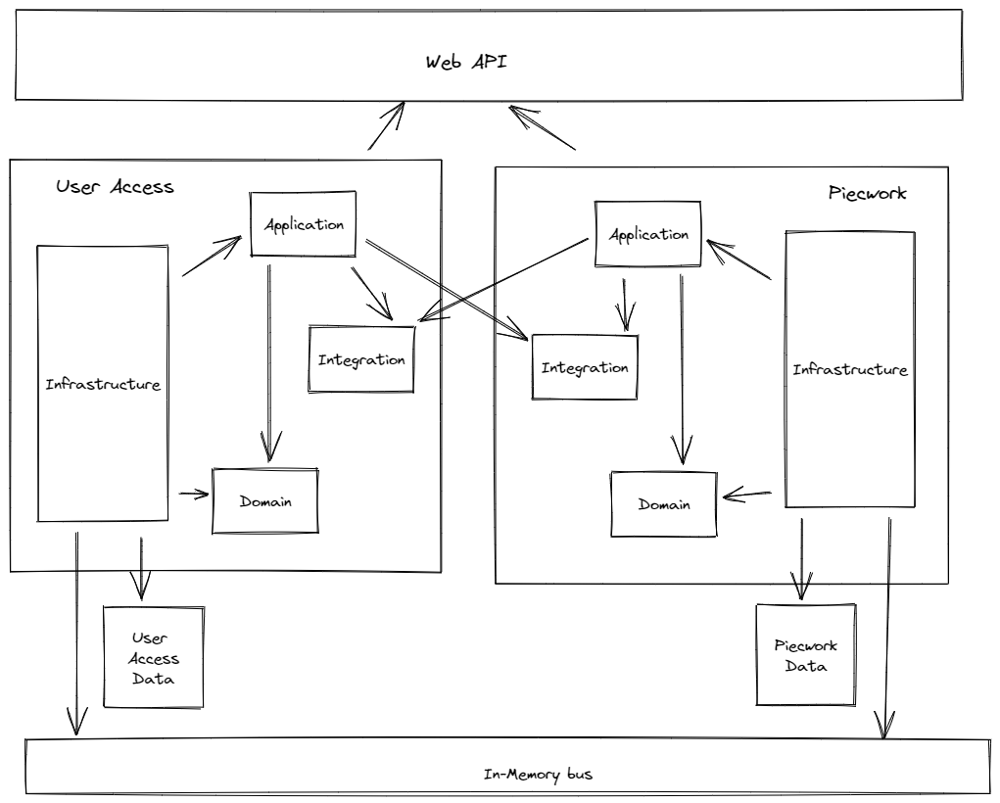
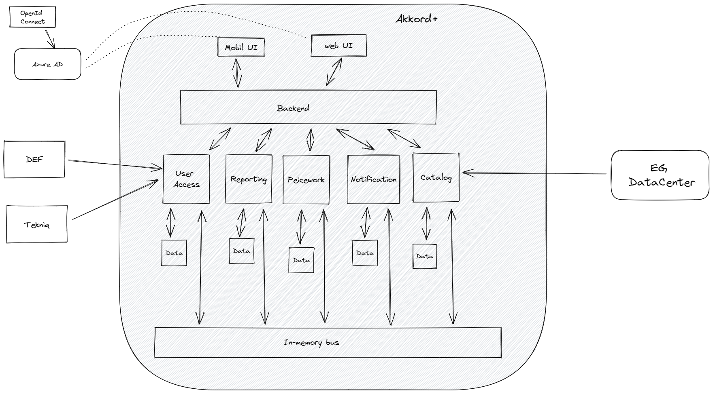
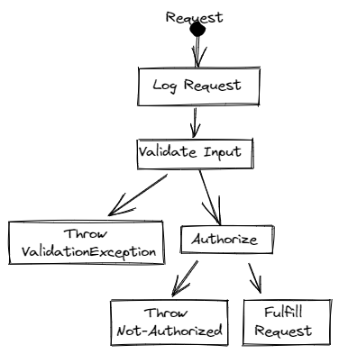

# DEFTQ Akkord+

- [DEFTQ Akkord+](#deftq-akkord)
  - [Intro](#intro)
    - [Terminology](#terminology)
  - [Scope](#scope)
    - [Primary functionality](#primary-functionality)
  - [Domain](#domain)
  - [Architecture](#architecture)
    - [System Context](#system-context)
    - [Containers](#containers)
    - [Components](#components)
    - [Module Description](#module-description)
      - [API](#api)
      - [User Access](#user-access)
      - [Piecework](#piecework)
      - [Notification](#notification)
      - [Reporting](#reporting)
      - [Catalog](#catalog)
      - [Key assumptions](#key-assumptions)
    - [Module Level View](#module-level-view)
    - [Module Requests Processing](#module-requests-processing)
      - [Cross-Cutting concerns](#cross-cutting-concerns)
        - [Logging](#logging)
        - [Validation](#validation)
        - [Authorization](#authorization)
  - [Technology](#technology)
  - [Architecture Decision Records](#architecture-decision-records)

## Intro

This document describes the architecture of the Akkord+ system. The guiding principles and general concepts for understanding this document is provided in [foundation.md](/docs/foundation.md). It is recomended to be familiar with the concepts described in the foundation document first.

### Terminology

See [terminology.md](/docs/terminology.md)

## Scope

The current scope of the project is to deliver an MVP. This MVP is not a 1-1 replacement of the existing EBA solution, but instead a new user friendly way to register the work done on a `Piecework`.

The system will be implemented as a web application. This removes the current need of a Windows PC and opens up the possibility for all users that has access to a device with a internet browser and a internet connection to use the system.

The web application will be implemented using [React](https://reactjs.org/) as an [PWA](https://en.wikipedia.org/wiki/Progressive_web_application) in order to support off-line capabilities.

The backend will be implemented using [Microsoft .NET](https://dotnet.microsoft.com/) as a Modular Monolith using Hexagonal Architecture.

Application data will be stored in a [PostgreSQL](https://www.postgresql.org/) database where each Module has it´s own schema.

Files will be stored in [Azure blob storage](https://azure.microsoft.com/en-us/services/storage/blobs/) where they will be protected by [Microsoft Defender for Cloud](https://docs.microsoft.com/en-us/azure/defender-for-cloud/defender-for-storage-introduction).

### Primary functionality

The primary use-cases supports a full workflow that enables `project manager`, `Akkordholder` and `Akkorddeltager` to use the system in a way that makes it possible to work on a `Piecework`.

Primary functionality in the MVP:

- Onboarding of Users of the system
- Creation and preparation of a `Byggesag` that potentially could lead to an `Akkordaftale`
- Registration of actual work - `Opmåling`
- Closing a `Akkordaftale`

To support the above mentioned functionality there is also a need to integrate external systems:

- EG Datacenter
- DEF Membership
- Tekniq Membership

It´s expected that these systems has well defined API´s that support the requirements the new system has.

## Domain

The core domain in the system is `Piecework`. See [Piecework](#piecework) for a more in depth description.

The main business entities in are `Byggesag`, `Akkordholder`, `Akkorddeltager` and `Opmåling`.

All users can create a new `Byggesag`. When they have created a `Byggesag` they will be the `Akkordholder` on that `Byggesag`.

`Akkordholder` can assign other users to the `Byggesag` and they will now be `Akkorddeltager` on the `Byggesag`. `Akkordholder` is also `Akkorddeltager` per definition.

`Akkordholder` can upload a PDF document of a signed `Akkordaftale` to a `Byggesag`. At this stage work performed by `Akkorddeltager` is now under an `Akkord`.

All users in a `Byggesag` can upload files. Files needs to be approved by `Akkordholder`. All uploaded files needs to be scanned by a Anti Virus. Therefor files will first be uploaded to an area outside the system where they will be scanned. When the file is scanned the file will be moved into the system so it can be approved by `Akkordholder`.

`Akkorddeltager` can register `Opmålinger` that have been performed on a `Byggesag`. `Opmålinger` registered by an `Akkorddeltager` must be approved by `Akkordholder`.

When the work that must be performed on an `Akkord` is done it enters a closing phase. Now starts a defined period - default 15 days - where `Akkordholder` and `Akkorddeltager` can make changes to the registrations on the `Akkord`. After the first period a new defined period - default 15 days - starts where the `Byggeherre` can criticize the `Akkord`. After these periods has ended the remaining payments is calculated and the `Byggesag` is closed. When the `Byggesag` is closed no new registrations or changes can be made on the `Akkord`.

An `Akkorddeltager` can always see `Akkorder` that they have been part of - even if they have left the  `Akkord`.

### Calculations

See [Beregninger](calculations.md)

## Architecture

### System Context

### Containers

### Components

To be filled in.

### Module Description

The application is build as a `Modular Monolith` where each `Module` has the responisibility for a logical business functionality. 

#### API

#### User Access

Responsible for user authentication and authorization.

Azure AD B2C is used as identity management and allows users to login via credentials they are in control of, eg. a Microsoft Account, Gmail of any other OpenID Connect provider.

When a users has gone through a login procedure we will match it up against a pool of allowed users inside the application. By having this split between login and a user in the application, we are able to allow users to see `Akkorder` they have worked on - even if they no longer are part of the `Akkord`.

#### Piecework

This module is the core domain.

In this module all the logic around ...

#### Notification

Handling of notification like send email, sms or notifying external systems.

#### Reporting

Handling of creating reports. Eg. creating PDF documents.

#### Catalog

The responsibility of this module is to keep track what an `Piecework participant` can register on a `Piecework`.

This module exposes data to be used when registering an `Opmåling` on an `Piecework`.

It is also in this module integration to 3.party systems like `EG DataCenter` is placed.

#### Key assumptions

TODO: Clarify how modules are allowed to communicate. Integration can use Application from other modules and Modules can be notified about internal changes in other Modules via Integration events

1. API contains no application logic
2. API communicates with Modules using a small interface to send Queries and Commands
3. Each Module has its own interface which is used by API
4. **Modules communicate with each other only asynchronously using Events Bus** - direct method calls are not allowed
5. Each Module **has it's own data** - shared data is not allowed
   - Module data could be moved into separate databases if desired
6. Modules can only have a dependency on the integration events assembly of other Module (see [Module level view](#124-module-level-view))
7. Each Module has its own [Composition Root](https://freecontent.manning.com/dependency-injection-in-net-2nd-edition-understanding-the-composition-root/), which implies that each Module has its own Inversion-of-Control container
8. API as a host needs to initialize each module and each module has an initialization method
9. Each Module is **highly encapsulated** - only required types and members are public, the rest are internal or private

### Module Level View

> The drawing below does not show the full overview, but only the principals.

Each Module has [Clean Architecture](https://blog.cleancoder.com/uncle-bob/2012/08/13/the-clean-architecture.html) and consists of the following submodules (assemblies):

- Application - - the application logic submodule which is responsible for requests processing: use cases, domain events, integration events
- Domain - Domain Model in Domain-Driven Design terms implements the applicable [Bounded Context](https://martinfowler.com/bliki/BoundedContext.html)
- Infrastructure - infrastructural code responsible for module initialization, background processing, data access, communication with Events Bus and other external components or systems
- Integration - **Contracts** published to the Events Bus; only this assembly can be called by other modules

> Application, Domain and Infrastructure assemblies could be merged into one assembly. Some people like horizontal layering or more decomposition, some don't. Implementing the Domain Model or Infrastructure in separate assembly allows encapsulation using the [`internal`](https://docs.microsoft.com/en-us/dotnet/csharp/language-reference/keywords/internal) keyword.
>
> In this project we have decided to go with separate assemblies for each submodule.

### Module Requests Processing

#### Cross-Cutting concerns

To support [Single Responsibility Principle](https://en.wikipedia.org/wiki/Single_responsibility_principle) and [Don't Repeat Yourself](https://en.wikipedia.org/wiki/Don%27t_repeat_yourself) principles, the implementation of cross-cutting concerns is done using the [Decorator Pattern](https://en.wikipedia.org/wiki/Decorator_pattern). Each Command processor is decorated by 3 decorators: logging, validation and authorization.

##### Logging

The Logging decorator logs execution, arguments, user and processing of each Command. This way each log inside a processor has the log context of the processing command.

##### Validation

The Validation decorator performs Command data validation. It checks rules against Command arguments using the FluentValidation library.

##### Authorization

## Technology

List of technologies, frameworks and libraries used for implementation:

- [.NET](https://dotnet.microsoft.com/download/dotnet/)
- [React](https://reactjs.org/)
- [PostgreSQL](https://www.postgresql.org/)
- [Marten](https://martendb.io/)
- [Mediatr](https://github.com/jbogard/MediatR)
- [FluentValidation](https://fluentvalidation.net/)
- [Swashbuckle](https://github.com/domaindrivendev/Swashbuckle)
- [XUnit](https://xunit.net/)
- [NetArchTest](https://github.com/BenMorris/NetArchTest)
- [PlantUML](https://plantuml.com/)
- [C4 Model](https://c4model.com/)
- [C4-PlantUML](https://github.com/plantuml-stdlib/C4-PlantUML)

## Architecture Decision Records

- [1. Record architecture decisions](adr/0001-record-architecture-decisions.md)
- [2. Use Azure AD B2C as IDP](adr/0002-use-azure-ad-b2c-as-idp.md)
- [3. Build as Modular Monolith](adr/0003-build-as-modular-monolith.md)
- [4. Use PostgreSQL and Marten](adr/0004-use-postgresql-and-marten.md)
- [5. Use React in the frontend](adr/0005-use-react-in-the-frontend.md)
- [6. Use .NET as programming platform](adr/0006-use-net-as-programming-platform.md)
- [7. Use PWA with service workers](adr/0007-use-pwa-with-service-worker.md)
- [8. Limiting data saved in local storage](adr/0008-limiting-data-saved-in-local-storage.md)
- [9. Backup solution](adr/0009-backup-solution.md)
- [10. Document upload](adr/0010-document-upload.md)
- [11. Multi tenancy](adr/0011-multi_tenancy.md)
